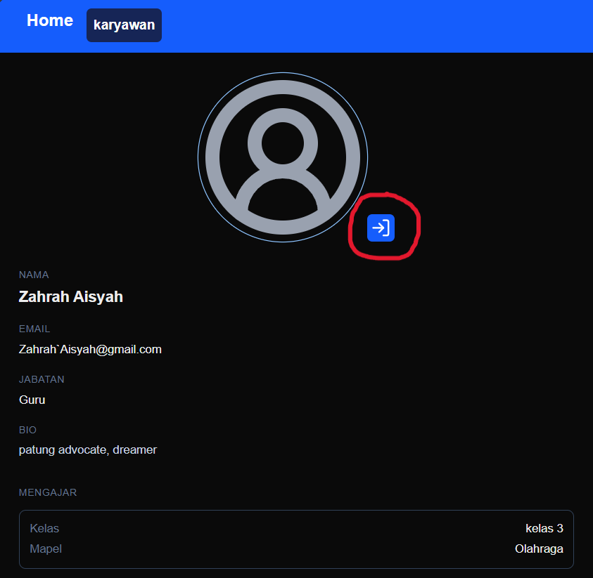
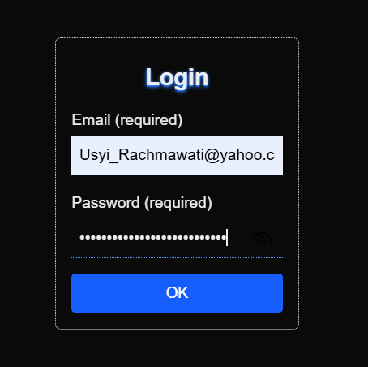
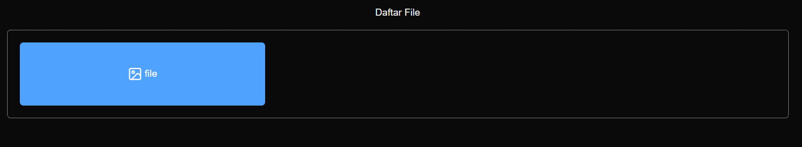
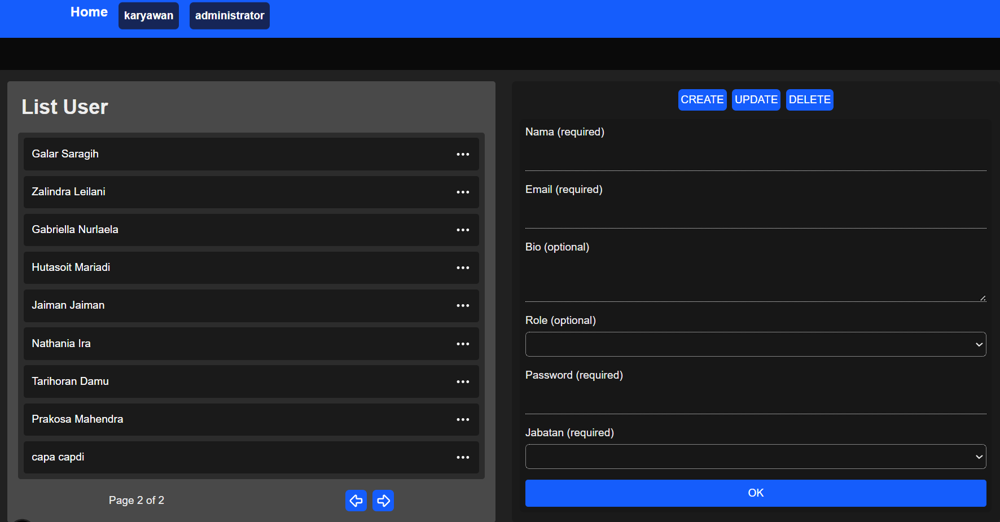
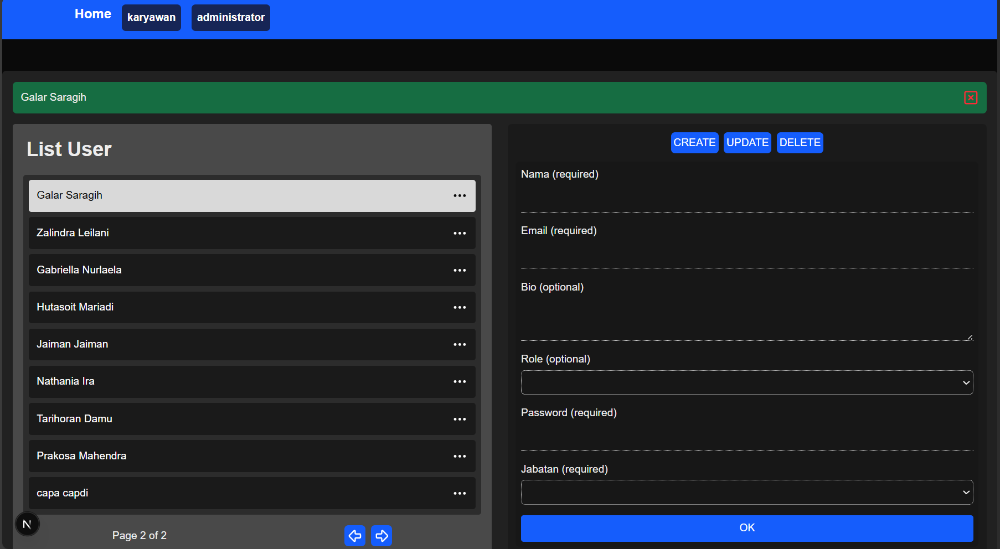

# Deskripsi Aplikasi

Tujuan dibuatnya aplikasi berbasis web ini adalah untuk menunjukkan profile sekolah, guru atau karyawan , dan pengarsipan file.

Menggunakan google drive sebagai media penyimpanan arsip file karena murah.

**web ini digunakan untuk :**
1. Menampilkan dan menyortir kepemilikan file ataupun folder untuk user yang sudah terdaftar.
2. Menampilkan informasi tentang sekolah (VISI & MISI), Logo, dan Slogan
3. Menampilkan informasi kontak user, ataupun status mengajar 

## Login

login dapat diakses pada halaman detail karyawan

masukkan email yang terdaftar dan passwordnya, klik ok, kemudian tunggu hingga muncul status login, halaman akan refresh secara otomatis

> [!IMPORTANT]
> Status Login bertahan hingga `1 jam`

status login disimpan di dalam cookie browser, tidak bisa dibaca oleh javascript. pengecekan status login terjadi di sisi server

## File

file yang terkait denga user akan ditampilkan setelah login, file yang ditampilkan merupakan link yang telah disimpan admin.

> [!NOTE]
> Mengeklik File atau Folder yang ditampilkan akan membawa user ke lokasi objek tersebut berada. (redirected)

## Administrator

Setelah Login, ketika teridentifikasi sebagai `ADMIN` bar `navigasi` akan menunjukkan halaman administrator, halaman ini tidak bisa diakses oleh publik atau user biasa, karena pengecekan hak akses halaman terjadi di sisi server.

### Formulir 

formulir digunakan untuk membuat data baru, mengedit data lama, atau menghapus data yang ada.

`Detail tentang data (skip jika ingin)`

 RDMBS

Dalam RDBMS (Relational Database Management System), data disimpan dalam bentuk tabel dan dapat saling berhubungan melalui relasi menggunakan primary key dan foreign key. Relasi ini membantu meminimalkan duplikasi data serta menjaga konsistensi dan integritas data.

    
Kardinalitas Data

    Adalah jumlah keterhubungan antar entitas dalam relasi tersebut.

    Jenisnya:

    Kardinalitas	Nama	    Makna
    1 : 1	    One-to-One	    Satu data berhubungan dengan satu data
    1 : N	    One-to-Many	    Satu data berhubungan dengan banyak data
    M : N	    Many-to-Many	Banyak data berhubungan dengan banyak data

    
Apa yang terjadi ketika menghapus data

    Jika ada relasi, maka penghapusan bisa mempengaruhi tabel lain tergantung aturan:

    CASCADE → ikut terhapus

    RESTRICT → tidak boleh dihapus

    SET NULL → relasi jadi kosong

    Ini disebut referential integrity.

Menghapus entitas independen akan menghapus entitas dependen ketika foreign key disetel ke `ONDELETE CASCADE`

contoh : menghapus entitas user atau kelas, atau mapel akan menghapus entitas mengajar
sebaliknya menghapus entitas mengajar tidak akan mempengaruhi entitas independen

dalam aplikasi ini `ONDELETE CASCADE` hanya terjadi ke tabel `mengajar` dan `mission`

---

### List Data
list data berada di sebelah kiri, tombol `titik tiga digunakan untuk melihat detail item`

## Formulir
formulir berada di sebelah kanan, terdapat tiga mode:
1. create : buat data baru
2. update : update data lama
3. delete : hapus data lama

### Label formulir
setiap label pada formulir terdapat keterangan `optional` atau `required`

- optional 
    - bebas diisi atau tidak
- required
    - harus diisi

### Pilih item

> [!IMPORTANT]
> Pilih item Sebelum Update atau delete, tidak memilih item membuat formulir beralih ke mode `CREATE`

> [!NOTE]
> kesalahan dalam pengisian akan diinformasikan setelah submit